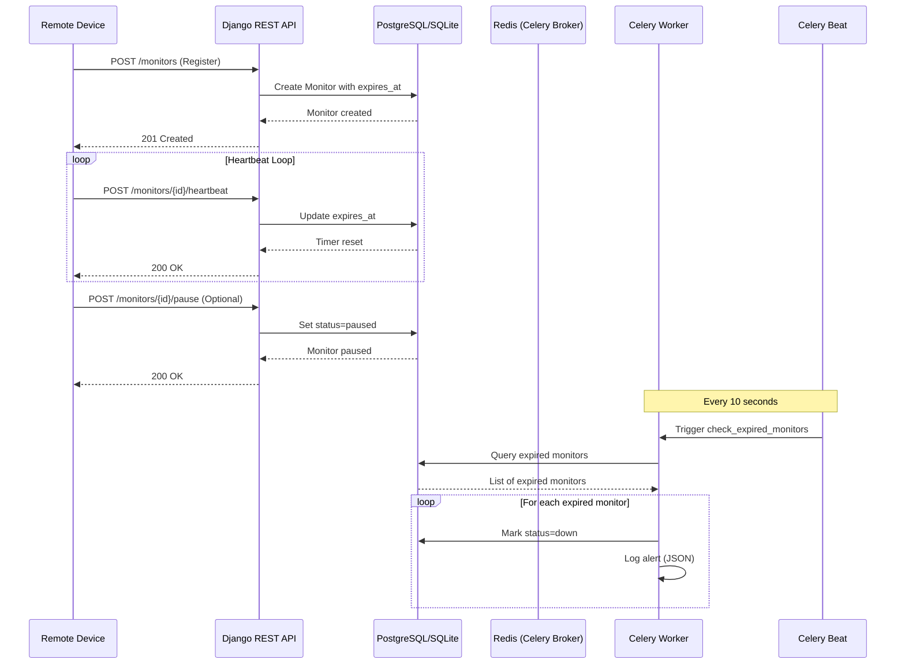

# Pulse-Check API - Dead Man's Switch System

A production-quality Django REST Framework backend for monitoring remote devices and triggering alerts when they go offline.

## Overview

Pulse-Check is a **Dead Man's Switch API** designed for critical infrastructure monitoring. Devices register with a countdown timer and must send periodic heartbeats. If a device fails to check in before the timer expires, the system automatically triggers an alert.

**Use Case:** Monitoring remote solar farms and unmanned weather stations in areas with poor connectivity.

## Architecture Diagram



## Tech Stack

- **Backend:** Django 6.0.4 + Django REST Framework 3.17.1
- **Task Queue:** Celery 5.6.3 with Redis 7.4.0
- **Scheduler:** django-celery-beat 2.9.0
- **Database:** SQLite (configurable for PostgreSQL)
- **Python:** 3.12+

## Setup Instructions

### Prerequisites

- Python 3.12 or higher
- Redis server running on localhost:6379
- Virtual environment (recommended)

### Installation

1. **Clone the repository:**
   ```bash
   git clone <your-repo-url>
   cd Pulse-Check
   ```

2. **Create and activate virtual environment:**
   ```bash
   python3 -m venv venv
   source venv/bin/activate  # On Windows: venv\Scripts\activate
   ```

3. **Install dependencies:**
   ```bash
   pip install -r requirements.txt
   ```

4. **Run database migrations:**
   ```bash
   python manage.py migrate
   ```

5. **Set up periodic tasks:**
   ```bash
   python manage.py setup_periodic_tasks
   ```

6. **Start Redis server** (if not already running):
   ```bash
   redis-server
   ```

7. **Start Celery worker** (in a separate terminal):
   ```bash
   celery -A pulse_check worker -l info
   ```

8. **Start Celery beat scheduler** (in another separate terminal):
   ```bash
   celery -A pulse_check beat -l info
   ```

9. **Start Django development server:**
   ```bash
   python manage.py runserver
   ```

The API will be available at `http://localhost:8000/api/monitors/`

## API Documentation

### Base URL
```
http://localhost:8000/api/monitors
```

### Endpoints

#### 1. Create Monitor
Register a new device monitor.

**Endpoint:** `POST /api/monitors/`

**Request Body:**
```json
{
  "id": "device-123",
  "timeout": 60,
  "alert_email": "admin@critmon.com"
}
```

**Response (201 Created):**
```json
{
  "id": "device-123",
  "timeout": 60,
  "alert_email": "admin@critmon.com",
  "status": "active",
  "expires_at": "2026-04-25T00:12:00Z",
  "message": "Monitor created successfully"
}
```

#### 2. Send Heartbeat
Reset the countdown timer for a device.

**Endpoint:** `POST /api/monitors/{id}/heartbeat/`

**Response (200 OK):**
```json
{
  "message": "Heartbeat received, timer reset",
  "monitor": {
    "id": "device-123",
    "status": "active",
    "last_heartbeat": "2026-04-25T00:11:30Z",
    "expires_at": "2026-04-25T00:12:30Z",
    "timeout": 60,
    "alert_email": "admin@critmon.com"
  }
}
```

**Error Response (404 Not Found):**
```json
{
  "detail": "Monitor with ID 'device-123' not found."
}
```

#### 3. Pause Monitor
Pause monitoring to prevent false alarms during maintenance.

**Endpoint:** `POST /api/monitors/{id}/pause/`

**Response (200 OK):**
```json
{
  "message": "Monitor paused successfully",
  "monitor": {
    "id": "device-123",
    "status": "paused",
    "last_heartbeat": "2026-04-25T00:11:30Z",
    "expires_at": null,
    "timeout": 60,
    "alert_email": "admin@critmon.com"
  }
}
```

#### 4. Get Monitor Details
Retrieve details of a specific monitor.

**Endpoint:** `GET /api/monitors/{id}/`

**Response (200 OK):**
```json
{
  "id": "device-123",
  "status": "active",
  "last_heartbeat": "2026-04-25T00:11:30Z",
  "expires_at": "2026-04-25T00:12:30Z",
  "timeout": 60,
  "alert_email": "admin@critmon.com"
}
```

#### 5. List All Monitors
List all monitors with optional status filtering.

**Endpoint:** `GET /api/monitors/list/`

**Query Parameters:**
- `status` (optional): Filter by status (`active`, `paused`, `down`)

**Response (200 OK):**
```json
[
  {
    "id": "device-123",
    "status": "active",
    "last_heartbeat": "2026-04-25T00:11:30Z",
    "expires_at": "2026-04-25T00:12:30Z",
    "timeout": 60,
    "alert_email": "admin@critmon.com"
  }
]
```

#### 6. Get Statistics
Get real-time system statistics and dashboard data.

**Endpoint:** `GET /api/monitors/statistics/`

**Response (200 OK):**
```json
{
  "total_monitors": 10,
  "active_monitors": 7,
  "paused_monitors": 2,
  "down_monitors": 1,
  "expiring_soon": 2,
  "uptime_percentage": 70.0
}
```

## Alert System

When a monitor expires (no heartbeat received before timeout), the system:

1. **Marks the monitor as down** in the database
2. **Logs an alert** in JSON format to console:
   ```json
   {
     "ALERT": "Device device-123 is down!",
     "time": "2026-04-25T00:12:00Z",
     "alert_email": "admin@critmon.com",
     "timeout": 60,
     "last_heartbeat": "2026-04-25T00:11:00Z",
     "monitor_id": "device-123"
   }
   ```

The alert is triggered by the Celery background worker running every 10 seconds.

## Developer's Choice: Monitor Statistics Dashboard

### Why I Added This Feature

In a production monitoring system, operators need real-time visibility into the overall health of the infrastructure. Without a dashboard, operators would need to manually query individual monitors or rely on external tools to understand system state.

The **Monitor Statistics Dashboard** provides:

1. **System Health Overview:** Quick snapshot of total, active, paused, and down devices
2. **Proactive Monitoring:** "Expiring soon" count identifies devices at risk of going offline
3. **Uptime Metrics:** Percentage calculation helps track overall system reliability
4. **Operational Efficiency:** Single API call replaces multiple queries for status breakdown

This feature enhances the system's observability and enables operators to make data-driven decisions about device maintenance and resource allocation.

### Implementation Details

- Uses Django ORM aggregation for efficient database queries
- Counts monitors expiring in the next 5 minutes for early warning
- Calculates uptime percentage as (active / total) * 100
- Available at `GET /api/monitors/statistics/`

## Project Structure

```
Pulse-Check/
├── monitors/
│   ├── management/
│   │   └── commands/
│   │       └── setup_periodic_tasks.py
│   ├── migrations/
│   ├── __init__.py
│   ├── admin.py
│   ├── apps.py
│   ├── models.py
│   ├── serializers.py
│   ├── services.py
│   ├── tasks.py
│   ├── urls.py
│   └── views.py
├── pulse_check/
│   ├── __init__.py
│   ├── asgi.py
│   ├── celery.py
│   ├── settings.py
│   ├── urls.py
│   └── wsgi.py
├── venv/
├── .gitignore
├── manage.py
├── README.md
└── requirements.txt
```

## Key Features

- **Race Condition Handling:** Uses `select_for_update()` and database transactions
- **Timezone-Aware:** All timestamps use UTC with Django's timezone support
- **Scalable Architecture:** Celery + Redis for background task processing
- **Clean Separation:** Service layer (AlertService) separates business logic from views
- **Idempotent APIs:** Heartbeat endpoint can be called multiple times safely
- **Pause Functionality:** Prevents false alarms during maintenance

## Testing the API

### Using cURL

**Create a monitor:**
```bash
curl -X POST http://localhost:8000/api/monitors/ \
  -H "Content-Type: application/json" \
  -d '{"id":"device-123","timeout":60,"alert_email":"admin@critmon.com"}'
```

**Send heartbeat:**
```bash
curl -X POST http://localhost:8000/api/monitors/device-123/heartbeat/
```

**Pause monitor:**
```bash
curl -X POST http://localhost:8000/api/monitors/device-123/pause/
```

**Get statistics:**
```bash
curl http://localhost:8000/api/monitors/statistics/
```

## License

This project is part of the AmaliTech DEG Project-based-challenges.
